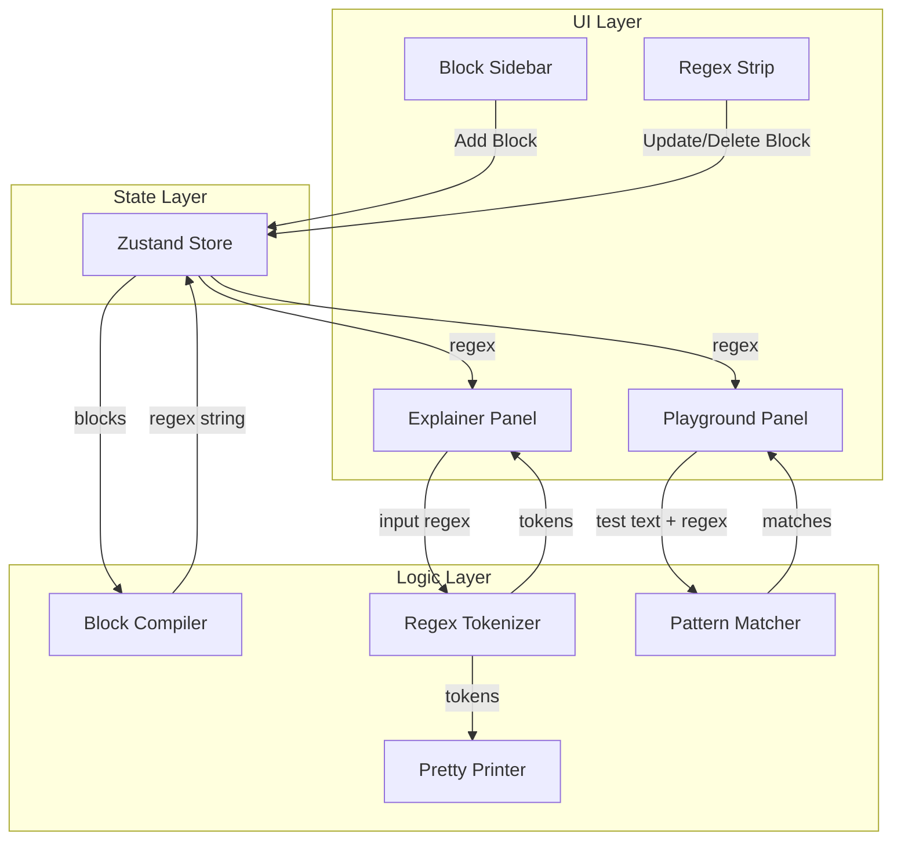

# Design Document: RegX Visual Regex Builder

## Overview

RegX is a deterministic visual regex builder that provides three core capabilities:
1. **Visual Builder**: Block-based UI for constructing regex patterns without syntax knowledge
2. **Explainer**: Tokenizer and mapper that translates regex strings to human-readable descriptions
3. **Playground**: Real-time pattern testing with match highlighting

The application is built with Next.js App Router, Zustand for state management, and Tailwind CSS for styling. All logic is 100% deterministic TypeScript with no external AI dependencies.

## Architecture



### Directory Structure

```
app/
├── layout.tsx          # Root layout with dark theme
├── page.tsx            # Main application page
├── globals.css         # Tailwind base styles
lib/
├── compiler.ts         # compileBlocksToRegex()
├── tokenizer.ts        # tokenizeRegex()
├── pretty-printer.ts   # tokensToRegex()
├── matcher.ts          # findMatches()
├── types.ts            # All TypeScript interfaces
store/
├── regex-store.ts      # Zustand store
components/
├── block-sidebar.tsx   # Available blocks panel
├── regex-strip.tsx     # Block assembly area
├── block-card.tsx      # Individual block component
├── playground.tsx      # Test area with highlighting
├── explainer.tsx       # Regex explanation panel
├── regex-preview.tsx   # Compiled regex display
```

## Components and Interfaces

### UI Components

#### BlockSidebar
- Displays available block types as clickable cards
- Each card shows block name and icon
- Click triggers `addBlock()` action in store

#### RegexStrip
- Renders current blocks from store
- Uses `@formkit/auto-animate` for smooth transitions
- Each block is deletable via X button
- Text/Digit blocks show inline input fields

#### BlockCard
- Visual representation of a single block
- Props: `block: Block`, `onDelete: () => void`, `onUpdate: (block: Block) => void`
- Renders appropriate input fields based on block type

#### Playground
- Text input for test string
- Displays test text with highlighted matches
- Shows match count and error state

#### Explainer
- Input field for pasting regex
- Renders token cards with descriptions
- Shows reconstructed regex from pretty-printer

#### RegexPreview
- Displays compiled regex string
- Copy-to-clipboard functionality

## Data Models

### Block Types

```typescript
type BlockType = 'START' | 'END' | 'TEXT' | 'DIGIT' | 'WHITESPACE' | 'OPTIONAL';

interface BaseBlock {
  id: string;
  type: BlockType;
}

interface StartBlock extends BaseBlock {
  type: 'START';
}

interface EndBlock extends BaseBlock {
  type: 'END';
}

interface TextBlock extends BaseBlock {
  type: 'TEXT';
  value: string;
}

interface DigitBlock extends BaseBlock {
  type: 'DIGIT';
  count: number;
}

interface WhitespaceBlock extends BaseBlock {
  type: 'WHITESPACE';
}

interface OptionalBlock extends BaseBlock {
  type: 'OPTIONAL';
  content: string;
}

type Block = StartBlock | EndBlock | TextBlock | DigitBlock | WhitespaceBlock | OptionalBlock;
```

### Token Types

```typescript
type TokenType = 
  | 'ANCHOR_START'
  | 'ANCHOR_END'
  | 'DIGIT'
  | 'WHITESPACE'
  | 'CHAR_CLASS'
  | 'LITERAL'
  | 'QUANTIFIER';

interface Token {
  type: TokenType;
  raw: string;           // Original regex substring
  description: string;   // Human-readable description
  quantifier?: {
    type: 'exact' | 'plus' | 'star' | 'optional';
    count?: number;
  };
}

interface TokenizeResult {
  success: boolean;
  tokens: Token[];
  error?: string;
}
```

### Store State

```typescript
interface RegexStore {
  blocks: Block[];
  compiledRegex: string;
  testText: string;
  explainerInput: string;
  
  // Actions
  addBlock: (type: BlockType) => void;
  removeBlock: (id: string) => void;
  updateBlock: (id: string, updates: Partial<Block>) => void;
  setTestText: (text: string) => void;
  setExplainerInput: (input: string) => void;
}
```

### Match Result

```typescript
interface MatchResult {
  success: boolean;
  matches: Array<{
    text: string;
    start: number;
    end: number;
  }>;
  error?: string;
}
```


## Correctness Properties

*A property is a characteristic or behavior that should hold true across all valid executions of a system-essentially, a formal statement about what the system should do. Properties serve as the bridge between human-readable specifications and machine-verifiable correctness guarantees.*

Based on the acceptance criteria analysis, the following correctness properties have been identified:

### Property 1: Compiler produces valid regex

*For any* array of blocks, the compiled output SHALL be a syntactically valid regex string that can be parsed by the JavaScript RegExp constructor without throwing an exception.

**Validates: Requirements 2.1**

### Property 2: Compiler block-to-regex mapping

*For any* block in the supported block types (START, END, DIGIT, WHITESPACE, OPTIONAL), the compiler SHALL produce the correct regex fragment:
- START → `^`
- END → `$`
- DIGIT with count N → `\d{N}`
- WHITESPACE → `\s`
- OPTIONAL with content C → `C?`

**Validates: Requirements 2.2, 2.3, 2.4, 2.6, 2.7**

### Property 3: Text block special character escaping

*For any* Text block containing special regex characters (`^$.*+?()[]{}|\`), the compiler SHALL escape those characters so the compiled regex matches the literal text.

**Validates: Requirements 2.5**

### Property 4: Tokenizer-PrettyPrinter round-trip

*For any* valid regex string composed of supported patterns, tokenizing the string and then pretty-printing the tokens SHALL produce a regex string that is semantically equivalent to the original.

**Validates: Requirements 3.15**

### Property 5: Tokenizer description mapping

*For any* regex string containing supported patterns (`^`, `$`, `\d`, `\s`, `[a-z]`, `[A-Z]`, `[0-9]`), the tokenizer SHALL produce tokens with descriptions that correctly identify the pattern type.

**Validates: Requirements 3.2, 3.3, 3.4, 3.5, 3.6, 3.7, 3.8**

### Property 6: Tokenizer quantifier handling

*For any* regex pattern followed by a quantifier (`{N}`, `+`, `*`, `?`), the tokenizer SHALL append the appropriate quantifier description to the preceding token.

**Validates: Requirements 3.9, 3.10, 3.11, 3.12**

### Property 7: Matcher correctness

*For any* valid regex pattern and test string, the matcher SHALL return match results that are identical to those produced by JavaScript's native `String.matchAll()` method.

**Validates: Requirements 4.1, 4.2**

### Property 8: Invalid regex graceful handling

*For any* malformed regex string, the matcher and tokenizer SHALL return an error result without throwing an uncaught exception.

**Validates: Requirements 4.4**

### Property 9: Block list addition

*For any* block list and any valid block type, adding a block SHALL increase the list length by exactly one and the new block SHALL appear in the list.

**Validates: Requirements 1.2**

### Property 10: Block list deletion

*For any* non-empty block list and any block ID present in the list, deleting that block SHALL decrease the list length by exactly one and the block SHALL no longer appear in the list.

**Validates: Requirements 1.3**

## Error Handling

### Compiler Errors
- Empty block array: Return empty string (not an error)
- Invalid block type: TypeScript type system prevents this at compile time
- Missing required fields (e.g., Text block without value): Use default empty string

### Tokenizer Errors
- Empty input: Return empty token array
- Malformed regex: Return partial tokens up to error point with error flag
- Unrecognized patterns: Treat as literal characters with "Literal: [value]" description

### Matcher Errors
- Invalid regex pattern: Catch RegExp constructor error, return `{ success: false, error: message }`
- Empty pattern: Return no matches
- Empty test string: Return no matches

### Store Error Prevention
- Generate unique IDs using `crypto.randomUUID()`
- Validate block updates before applying
- Debounce rapid state changes (100ms)

## Testing Strategy

### Property-Based Testing Library
**fast-check** will be used for property-based testing due to its TypeScript-first design and excellent shrinking capabilities.

### Unit Tests
Unit tests will cover:
- Individual block compilation (one test per block type)
- Token description mapping (one test per pattern type)
- Edge cases: empty inputs, special characters, boundary values
- Error handling paths

### Property-Based Tests
Each correctness property will be implemented as a property-based test:

1. **Property 1 (Valid regex)**: Generate random block arrays, compile, verify RegExp constructor accepts output
2. **Property 2 (Block mapping)**: Generate individual blocks, verify correct regex fragment
3. **Property 3 (Escaping)**: Generate strings with special characters, verify literal matching
4. **Property 4 (Round-trip)**: Generate valid regex strings, verify tokenize→prettyPrint identity
5. **Property 5 (Descriptions)**: Generate regex with known patterns, verify description content
6. **Property 6 (Quantifiers)**: Generate quantified patterns, verify quantifier descriptions
7. **Property 7 (Matcher)**: Generate regex and test strings, compare with native matchAll
8. **Property 8 (Error handling)**: Generate malformed regex, verify graceful error return
9. **Property 9 (Addition)**: Generate block lists and types, verify length increase
10. **Property 10 (Deletion)**: Generate non-empty lists, verify length decrease

### Test Configuration
- Minimum 100 iterations per property test
- Each property test tagged with: `**Feature: regx-visual-builder, Property {N}: {description}**`

### Test File Structure
```
__tests__/
├── lib/
│   ├── compiler.test.ts      # Properties 1, 2, 3
│   ├── tokenizer.test.ts     # Properties 4, 5, 6
│   ├── matcher.test.ts       # Properties 7, 8
│   └── store.test.ts         # Properties 9, 10
```
